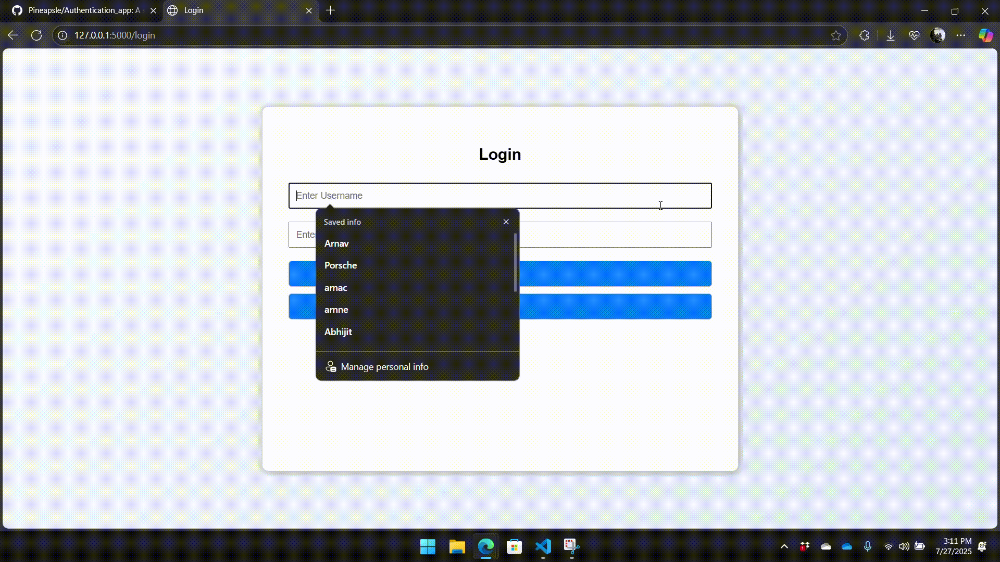

# 🔐 Elegant Login System with Flask

A lightweight, professionally styled user authentication interface built with Flask, HTML/CSS, and SQLAlchemy. Designed with responsive containers, accessible visual polish, and smooth UX, this project demonstrates secure login mechanics while preserving modularity for future feature expansion.

## 🚀 Features

- ✅ User registration & login
- 🔐 Secure password hashing and session handling
- 📦 Modular structure with reusable helpers
- ✨ Responsive layout with subtle animations
- 🧹 Account deletion with confirmation flow
- ⚠️ Invalid login handling with styled feedback

---

## 🧠 Tech Stack

| Layer      | Technologies / Libraries            |
|------------|-------------------------------------|
| Backend    | Python, Flask, SQLAlchemy, Flask-Login |
| Frontend   | HTML5, CSS3, JavaScript             |
| UI/UX      | Custom CSS animations, Flexbox/Grid |
| Auth Flow  | Secure password hashing (Werkzeug) |
| Versioning | Git, GitHub                         |

---

## 🎬 Feature Walkthroughs

Here are demo GIFs showing key user flows:

| Action                  | Preview                            |
|-------------------------|------------------------------------|
| 🆕 Account Creation      |  |
| 🔓 Login                |  |
| ⌠Invalid Login        |  |
| 🗑️ Account Deletion     |  |

> 🎥 *Make sure the `.gif` files are stored in your `/static` folder for proper rendering.*

---

## 📁 Getting Started

```bash
# Clone the repo
git clone https://github.com/Pineapsle/Authentication_app.git

# Move into the project
cd Authentication_app

# Launch the app
flask run
```

The app will be served locally at `http://127.0.0.1:5000`.

The app has its own users.txt file with usernames and passwords for debugging. 

---

## 🧪 Developer Tips

- 🔧 Helper functions for account logic live in `/helpers/`
- 🎨 Templates are stored in `/templates/`
- 📁 Static assets (CSS, JS, media) live in `/static/`
- 🧠 Form validations and error feedback built-in

---

## 🤝 About the Project

This app was built to reinforce secure user authentication flows and professional-grade UI styling as a boilerplate for other apps. Emphasis is placed on modular code organization, responsive design, and real-world usability. 

For questions, improvements, or collaboration — feel free to reach out!
